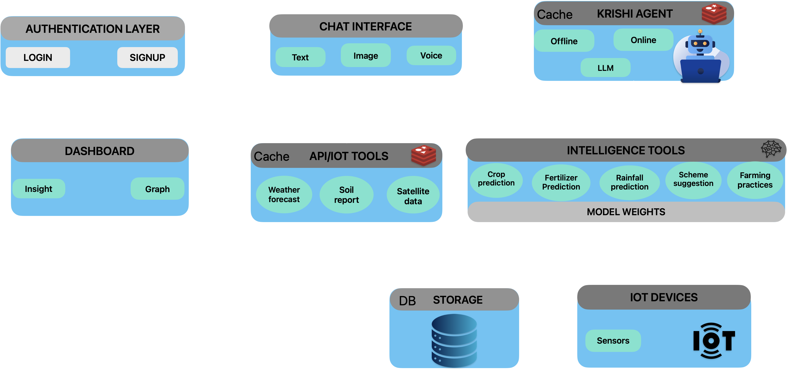

# 🌾 Krishi Mitra – Smart Farming Assistant

An **AI-powered Smart Farming Assistant** that helps farmers make **data-driven agricultural decisions** using weather insights, soil analysis, crop prediction, and intelligent recommendations.

This system combines:

* 🤖 AI Agents (online + offline)
* 🌦 Weather + Soil APIs
* 🌱 ML Models (crop + fertilizer prediction)
* 🌐 Meta-search engine (SearXNG)
* 🗣 Multilingual + Voice support
* ⚡ Fast React frontend (deployed on Vercel)

---

# 🚀 Features

## 🌦 Weather Intelligence

* Real-time + forecast weather
* Wind, humidity, temperature insights
* Smart alerts (rain, drought, pest risk)

## 🌱 Soil Health Analysis

* Moisture, temperature, pH tracking
* Soil condition classification
* Irrigation recommendations

## 🌾 Crop Yield Prediction

* ML-based predictions
* Uses historical + environmental data

## 🧪 Fertilizer Recommendation

* Crop-specific fertilizer suggestions
* Optimized for soil conditions

## 🧠 AI Decision Engine

* Combines multiple data sources
* Provides actionable insights

## 🌍 Multilingual Support

* Supports Hindi + regional languages
* Uses Sarvam models + Google Translate fallback

## 🔊 Voice Features

* Speech-to-text (input)
* Text-to-speech (output)

## 📡 Offline Support

* Cached weather data
* Local AI models for low connectivity areas

## 🔎 Meta Search (SearXNG)

* Aggregates farming knowledge from multiple sources
* Used for RAG-based responses

## 🏛 Government Schemes RAG

* Farmer schemes knowledge base
* Query-based retrieval

---

## 🧠 System Workflow & Architecture



---

# 🖥 Frontend (React + Vite)

### 🌐 Live Deployment

Frontend is hosted on **Vercel**

### ⚙️ Tech Stack

* React (Vite)
* Context API (State Management)
* CSS Modules
* Speech + Translation utilities

---

## 📁 Frontend Structure

```
Frontend/
│── public/
│── src/
│   ├── components/
│   │   ├── ChatPanel.jsx
│   │   ├── AdvisoryTicker.jsx
│   │   ├── LanguageSelect.jsx
│   │   ├── HamburgerMenu.jsx
│   │   ├── schemes/
│   │   │   └── SchemeCard.jsx
│   │   ├── speakText.js
│   │   ├── sarvamTranslate.js
│   │   └── useSpeechRecognition.js
│   │
│   ├── context/
│   │   ├── AppContext.jsx
│   │   └── AuthContext.jsx
│   │
│   ├── pages/
│   │   ├── AuthPage.jsx
│   │   ├── SchemesListPage.jsx
│   │   └── SchemeDetailPage.jsx
│   │
│   ├── routes/
│   │   └── ProtectedRoute.jsx
│   │
│   ├── data/
│   │   ├── languages.js
│   │   └── schemes.js
│   │
│   ├── App.jsx
│   ├── AppWithAuth.jsx
│   └── main.jsx
```

---

## ▶️ Frontend Setup

```bash
cd Frontend

npm install
npm run dev
```

---

## 🌐 Deployment (Vercel)

```bash
npm run build
```

Then deploy via:

* Vercel dashboard OR
* `vercel deploy`

---

# ⚙️ Backend (AI + Services)

## 🧠 Core Capabilities

* AI agents (online + offline)
* Weather + soil APIs
* ML models for crop & fertilizer prediction
* RAG pipelines (schemes + farming practices)
* Caching system (SQLite)

---

## 📁 Backend Structure

```
app/
├── agents/          # AI agents (decision making)
├── services/        # External APIs (weather, soil)
├── tools/           # Crop, fertilizer, weather tools
├── translation/     # Language conversion
├── schemas/         # Request/response models
├── data/            # Cache + datasets
├── searxng-local/   # Meta-search engine (Docker)
```

---

## 🔑 Required API Keys

Create `.env` file:

```env
OPENWEATHER_API_KEY=your_key
LLM_API_KEY=your_key

NVIDIA_MODEL_NAME=nvidia/nemotron-3-super-120b-a12b:free
GPT_MODEL_NAME=openai/gpt-oss-120b:free

SARVAM_MODEL_API=https://your-api
SARVAM30_MODEL_NAME=sarvam-30b
SARVAM105_MODEL_NAME=sarvam-105b
SARVAM_M_FREE=sarvam-m
AMBEE_DISASTER_API=your_key
AGRO_POLYGON_ID=your_polygon_id
AGRO_MONOTRONIG_API=your_agro_key
```

---

## 🛠 Backend Setup

```bash
git clone https://github.com/ganeshnikhil/krishi-dristi-agent.git
cd backend

python3 -m venv venv
source venv/bin/activate   # Linux/Mac
venv\Scripts\activate      # Windows

pip install -r requirements.txt
```

---

## ▶️ Run Backend

```bash
python main.py
```

---

# 🧠 SearXNG Meta Search Setup

```bash
cd app/searxng-local

docker-compose up -d
```

Stop:

```bash
docker-compose down
```

---

# ⚡ How the System Works

### Step-by-step flow:

1. 👨‍🌾 Farmer asks question
   *“Which fertilizer for wheat?”*

2. 🤖 Agent selection

   * Online / Offline AI agent

3. 🛠 Tool usage

   * Weather API
   * Soil API
   * ML models

4. 🧠 AI reasoning

   * Combines all inputs

5. 🌍 Translation

   * Converts to user language

6. 🔊 Voice output (optional)

---

# 🗂 Caching System

* Location:

```
app/data/weather_cache.sqlite
```

* Purpose:

  * Reduce API calls
  * Enable offline usage
  * Faster responses

---

# 📊 UI Overview

### Dashboard Includes:

* 🌦 Weather panel
* 🌱 Soil health card
* 💧 Irrigation advisory
* ⚠️ Alerts ticker
* 📅 Timeline forecast

---

# ⚠️ Important Notes

* Python **3.12.2 required**
* Ensure `app/data/` exists
* API keys required for full functionality
* System provides **advisory only**

---

# 🌟 Benefits

* 📈 Better crop decisions
* ⚡ Fast + offline-capable
* 🌍 Multi-language support
* 🤖 AI-powered recommendations
* 📡 Real-time + predictive insights

---

# 🔮 Future Improvements

* Satellite data integration
* Pest detection via images
* IoT sensor integration
* Farmer community features
